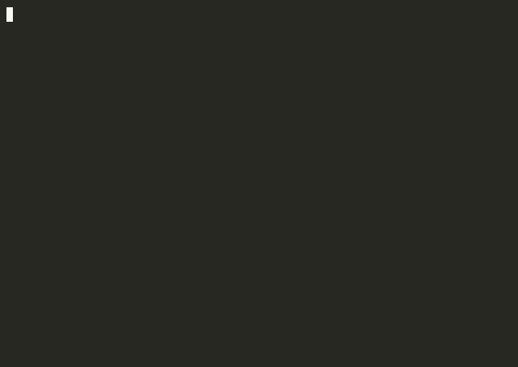

# multicloud-healer

A Kubernetes controller that watches pod and node health and takes a
remediation action (restart a stuck pod, cordon and drain an unhealthy node)
after a configurable number of consecutive failed checks, not on the first
one.



## What this is / isn't

The GIF above is a real run against a local `kind` cluster: a Deployment
whose pod's readiness probe always fails (so it stays `0/1 Running`
forever), and `multicloud_healer.controller` detecting it and restarting it,
repeatedly. This is a proof of concept run locally, not a claim of running
against a production EKS or GKE cluster. Node remediation (cordon + drain)
is real code exercised by unit tests against a fake clientset, since safely
demonstrating a node going NotReady against a single-node kind cluster would
take the whole cluster down with it; see `tests/test_controller.py` and
`tests/test_remediate.py`.

## Why this exists

AWS EKS and GCP GKE label nodes differently for the same concepts (node
pool, region, zone). A controller that reasons about "which node pool is
this" or logs "unhealthy node in us-west-2 on the gpu-pool nodegroup" needs
an adapter over both label sets, or it only works on one cloud. See
`multicloud_healer/cloud.py`: `detect_provider()` picks the right adapter
from a node's labels, so the rest of the controller only ever deals with one
`NodeMetadata` shape regardless of which cloud the node came from.

## Architecture

```
kubectl / kubeconfig or in-cluster service account
                |
                v
        CoreV1Api client
                |
   +------------+------------+
   |                         |
   v                         v
list pods (label       list nodes
selector)               (--watch-nodes)
   |                         |
   v                         v
pod_is_healthy()        node_is_healthy()
(health.py)               (health.py)
   |                         |
   v                         v
ConsecutiveFailureTracker (health.py)
   |                         |
   | threshold crossed       | threshold crossed
   v                         v
restart_pod()            detect_provider() (cloud.py)
(remediate.py)              |
                             v
                        cordon_and_drain_node()
                        (remediate.py)
```

## Running it against a local kind cluster

```bash
kind create cluster --name healer-demo
python3.12 -m venv .venv
. .venv/bin/activate
pip install -r requirements.txt

kubectl apply -f demo/flaky-app.yaml
python -m multicloud_healer.controller \
  --context kind-healer-demo \
  --label-selector app=flaky-app \
  --failure-threshold 3 \
  --poll-interval 2 \
  --cycles 6
```

## Running it in-cluster

```bash
docker build -t multicloud-healer:latest .
kind load docker-image multicloud-healer:latest --name healer-demo
kubectl apply -f k8s/rbac.yaml
kubectl apply -f k8s/deployment.yaml
```

`k8s/rbac.yaml` grants exactly the verbs the controller uses: get/list/delete
on pods, create on pods/eviction, get/list/patch on nodes. `build_api()` in
`controller.py` tries in-cluster config first and falls back to the local
kubeconfig, so the same binary runs both ways.

## CLI flags

| flag | default | meaning |
|---|---|---|
| `--context` | current kubeconfig context | which cluster to talk to |
| `--namespace` | `default` | namespace to watch pods in |
| `--label-selector` | `""` | which pods to watch |
| `--failure-threshold` | `3` | consecutive bad checks before remediating |
| `--poll-interval` | `5.0` | seconds between checks |
| `--cycles` | `0` (forever) | stop after N cycles, used by the demo and CI |
| `--watch-nodes` | off | also watch node Ready conditions and cordon+drain on failure |
| `--dry-run` | off | log what would be remediated without calling the mutating API (restart/cordon/drain) |
| `--max-remediations` | unlimited | give up on a pod/node after this many remediation attempts without a full recovery in between, instead of restarting or draining it forever |

`--max-remediations` exists because the consecutive-failure threshold alone
doesn't stop a restart storm: a pod with a bad image or a node with failing
hardware will just fail the same way again right after being remediated,
forever. Past the limit the controller logs it and stops touching that
pod/node until it actually recovers on its own (the attempt count clears the
moment a poll sees it healthy again).

## Tests

```bash
pip install -r requirements-dev.txt
pytest -v
```

All 38 tests use a fake `CoreV1Api` (`unittest.mock.MagicMock`) plus real
`kubernetes.client` model objects (`V1Pod`, `V1Node`, ...), so they run with
no cluster and no network. CI additionally runs a `kind` integration job
(`.github/workflows/ci.yml`) that creates a real cluster, deploys
`demo/flaky-app.yaml`, and checks the controller actually restarted the
stuck pod.

## Repo layout

```
multicloud_healer/
  cloud.py       # AWS EKS vs GCP GKE node label adapter
  health.py       # pod_is_healthy, node_is_healthy, ConsecutiveFailureTracker
  remediate.py    # restart_pod, cordon_node, drain_node (real Eviction API)
  controller.py   # poll loop wiring the above together, CLI entrypoint
tests/
demo/
  flaky-app.yaml
  run_demo.sh
k8s/
  rbac.yaml
  deployment.yaml
Dockerfile
```
